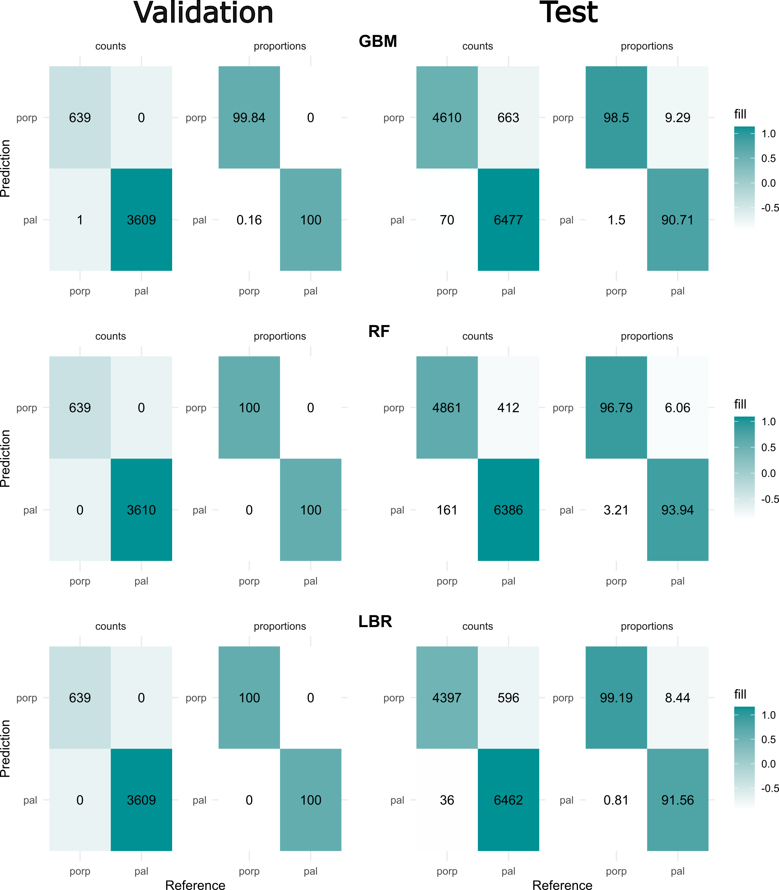
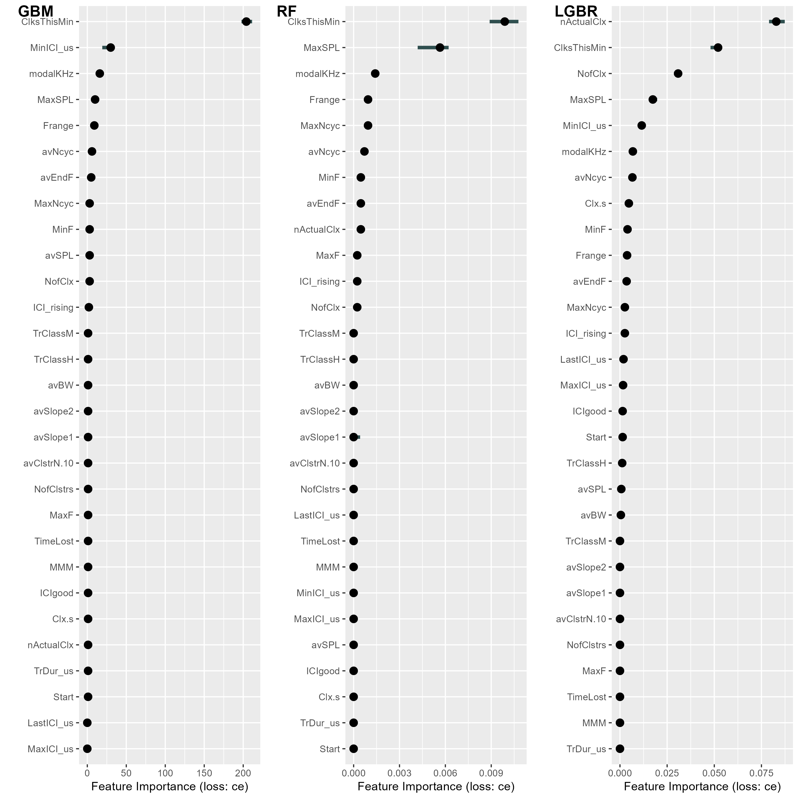

# PAL Classifier

## Description

This repository provides a series of scripts to run a pre-trained ML ensemble for classification between artificial and natural porpoise calls detected by the CPOD (Cetacean and Porpoise Detector).

## Context

Passive acoustic monitoring devices like the [CPOD](https://www.chelonia.co.uk/cpod.htm)  are essential for wildlife monitoring, allowing to collect large amounts of data. One of the key features of the CPOD is that the device does not store the acoustic data and instead process the detection on site, storing only a set of variables that describe the detected call. This allows the device to be highly efficient in terms of storage and energy.

In the recent years a new device called the Porpoise Alert [(PAL)](https://www.sciencedirect.com/science/article/pii/S0165783620302496?via%3Dihub) has gained popularity as a way to control porpoise bycatch from gillnets. However,  since PALs work by emitting a pre-recorded porpoise alert sound they can affect the accuracy of C-PODs, that will register this artificial call as a natural porpoise.

To solve this problem we present a pre-trained ensemble model that can accurately classify observations as natural or artificial based on the variables stored by the CPOD. The model reached up to 95% accuracy during training and testing. Further processing is also available to deal with potential false negatives.

## Requirements and "Installation"

It is assumed that the user has basic understanding of R.

To use this script just download the entire repository. Make sure that root of this repository is your working directory, in other words `getwd()` should return something like `"C:\Path_to_folder\PAL_porp_classifier_scripts"`.

All the scripts are written in R. The models are stored as R-objects from the package [caret](https://www.jstatsoft.org/article/view/v028i05). Other packages required are glue, plotROC, pROC, ggplot2, dplyr, caTools, gbm, randomForest and butcher

## Inference

The repository contains our trained model objects and they can be used without further modification (later sections will show how to train your own model) the models sizes have been reduced using the package [butcher](https://butcher.tidymodels.org/) to fit into this repository. Open the `1_Prediction.R` script, this is a simple script that run our ensemble using some custom functions.

The inference  is carried out by a main function `run_predictions` and other auxiliary functions. For these functions to work make sure that you source the `utils_functions.r` script and load the pre-trained models.

```r
library(caret)
library(dplyr)
library(caTools)
library(gbm)
library(randomForest)
# source the functions
source("0_utils_functions.r")
# Load the three models
load("models/fit_gbm.RData")
load("models/fit_rf.RData")
load("models/fit_log_reg_boost.RData")
# load your data
all_data_tb <- read.csv("your_CPOD_data.csv")

```

 `run_predictions` first does some  preprocessing  including checking that the relevant columns are present in the dataset, and one hot encoding of the factor variables. This function has three arguments, the  data frame to run the inference in, a csv with the thresholds (provided in this repository) for the models and boolean argument to indicate if probabilities or the prediction categories should be returned.

```r
predictions_df <- run_predictions(
  data = all_data_tb,
  threshold_file = "thresholds2.csv",
  return_probs = "FALSE"
)
```

The resulting dataframe contains the same number of rows as the original data and four columns that correspond to the predictions for each model and a fourth column for the ensemble prediction (remember than 0 means PAL and 1 means a porpoise call).

| lrb| gbm| rf| ensemble|
|:---:|:---:|:--:|:--------:|
| 1  | 0  | 1 |   1     |
| 1  | 1  | 1 |   1     |
| 1  | 1  | 1 |   1     |
| 0  | 1  | 1 |   1     |
| 1  | 0  | 0 |   0     |
| 1  | 1  | 1 |   1     |

We can combine this prediction df  with the original dataframe and perform some post-processing.
Despite their very high accuracy, our models (as with any ML model) can still make some errors, this specially true for the PALs. Because of this we created a method to erase PAL detections that are very likely false negatives.

The method is based on the notion that PALs are coming from glints that are placed for several hours in a row. We want to ensure that signals that were  assigned to PALs only remain as PAL if PAL signals occur over at least two consecutive hours. Otherwise, they should be corrected to Porpoises.

We wrote a function called `post_processing` that carries out this step. For running this function we need to combine our predictions with the original data frame

```r
# combine the original data with predictions
data_and_predictions <- bind_cols(all_data_tb, predictions_df) 
data_and_predictions <- post_processing(data_and_predictions)
# compare the results
corr_comp <- with(
  data_and_predictions,
  cbind(table(ensamble), table(corrected_category))
)
colnames(corr_comp) <- c("Before Correction", "After Correction")
rownames(corr_comp) <- c("PAL", "porp")
corr_comp
```

As can be seen the function adds a new column called `corrected_category` that removes the PAL detections that occurred on a single hour.

|Var |  Before correction|After correction|
|:----:|:-----:|:-----:|
|PAL    |   566|240|
|porp    | 39988|40314|

Finally `run_predictions` can also return the raw probabilities for ech observation when  `return_prob = TRUE` then the function returns a list of length three with each element of the list being a dataframe with two columns containing the probability for each category.

```r
predictions_df <- run_predictions(
  data = all_data_tb,
  threshold_file = "thresholds2.csv",
  return_probs = "FALSE"
)
predictions_df$gbm |> head()
```

|    pal    |   porp    |
|:---------:|:---------:|
| 0.0179862 | 0.9820138 |
| 0.0179862 | 0.9820138 |
| 0.1192029 | 0.8807971 |
| 0.0000001 | 0.9999999 |
| 0.0000008 | 0.9999992 |
| 0.0000000 | 1.0000000 |

## Training script and performance

The training script is available in `training_and_test.R`. The training process requires a labeled csv file that contains all the variables that are normal output of the C-POD and an additional column `click` that identifies the ground truth for the observations. In our script we started with two already distinct files for training and testing, so make sure to split  you labelled dataset  into a train and test set.

The complete description of the training can be found in our publication. These models are still being updated with new hyperparameters and we expect to add more training data in the future. The  hyperparameters and performance of the models in the current version of this repository are presented below. 

### Hyperparameters

|Model|Hyperparameters|Value|
|:-----:|:-----:|:-----:|
|GBM| <ul><li>Number of trees </li><li>Interaction depth</li><li> Shrinkage</li> <li>Min # obs in node</li> </ul>|<ul><li>150</li><li>5</li><li>0.1</li> <li>25</li> </ul>|
|Boosted Logistic Regression|# Iterations|84|
|RF|# Variables per split|3|

### Performance

#### Confusion matrix



|                     | GBM  Val| RF Val| LBR Val| GBM Test| RF Test| LBR Test|
|:--------------------|---------:|---------:|---------:|---------:|---------:|---------:|
|Sensitivity          | 0.99| 1.00| 1.00| 0.98| 0.97| 0.99|
|Specificity          | 1.00| 1.00| 1.00| 0.87| 0.92| 0.88|
|Pos Pred Value       | 1.00| 1.00| 1.00| 0.90| 0.93| 0.91|
|Neg Pred Value       | 0.99| 1.00| 1.00| 0.98| 0.96| 0.99|
|Precision            | 1.00| 1.00| 1.00| 0.90| 0.93| 0.91|
|Recall               | 0.99| 1.00| 1.00| 0.98| 0.97| 0.99|
|F1                   | 0.99| 1.00| 1.00| 0.94| 0.95| 0.95|
|Prevalence           | 0.84| 0.84| 0.84| 0.55| 0.55| 0.56|
|Detection Rate       | 0.84| 0.84| 0.84| 0.54| 0.54| 0.56|
|Detection Prevalence | 0.84| 0.84| 0.84| 0.60| 0.57| 0.61|
|Balanced Accuracy    | 0.99| 1.00| 1.00| 0.93| 0.94| 0.93|

#### Variable importance


